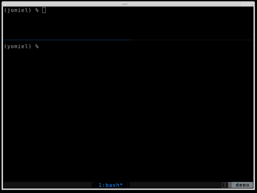

# yomiel

`yomiel` is the pretty printer for [jomiel][1] messages.

## Features

- Support for authentication and encryption (CURVE and SSH)
- Support for different output formats (raw/json/yaml)
- Highly configurable

## Screencast

[](media/screencast.png)

**Description**

1. Start [jomiel][1]
2. Send an inquiry using yomiel
    - Use different output filters (json, terse)

## License

`yomiel` is licensed under the [Apache License version 2.0][23] (APLv2).

## Requirements

`yomiel` is written for [Python][22] 3.5 and later.

## Installation

You can install the latest version from either [PyPI][24] or from the
git repository.

### PyPI

```shell
$ pip install yomiel        # for the latest release
$ yomiel <uri ...>          # inquiry meta data for the given URI
```

### git repository

Make sure you have installed the *protobuffer library* and the
*compiler*. For example, on Debian based systems these are the
`libprotobuf*` and the `protobuf-compiler` packages.

```shell
$ git clone https://github.com/guendto/jomiel-yomiel.git
$ cd jomiel-yomiel
$ pip install -r ./requirements.txt
$ python setup.py build_py  # generate the protobuf message bindings
$ python yomiel <uri ...>   # inquiry meta data for the given URI
```

## HOWTO

### Authentication and encryption using CURVE / SSH

See the corresponding [jomiel][1] entries:

- [HOWTO: Authentication and encryption using CURVE][10]
- [HOWTO: Authentication and encryption using SSH][11]

## Development notes

### Subprojects

`yomiel` includes (as `git-subtree`) the following subprojects within
the subdirectories:

- [jomiel-proto.git][3] (yomiel/comm/proto)
- [jomiel-comm.git][2]  (yomiel/comm)
- [jomiel-kore.git][4]  (yomiel/kore)

### Acknowledgements

- Linted by [pylint][25], [flake8][26] and [yamllint][27]
- Formatted by [yapf][28]

[1]: https://github.com/guendto/jomiel/
[2]: https://github.com/guendto/jomiel-comm/
[3]: https://github.com/guendto/jomiel-proto/
[4]: https://github.com/guendto/jomiel-kore/
[10]: https://github.com/guendto/jomiel/#authentication-and-encryption-using-curve
[11]: https://github.com/guendto/jomiel/#authentication-and-encryption-using-ssh
[22]: https://www.python.org/about/gettingstarted/
[23]: https://tldrlegal.com/license/apache-license-2.0-(apache-2.0)
[24]: https://pypi.org/
[25]: https://pypi.org/project/pylint/
[26]: https://pypi.org/project/flake8/
[27]: https://pypi.org/project/yamllint/
[28]: https://pypi.org/project/yapf/
